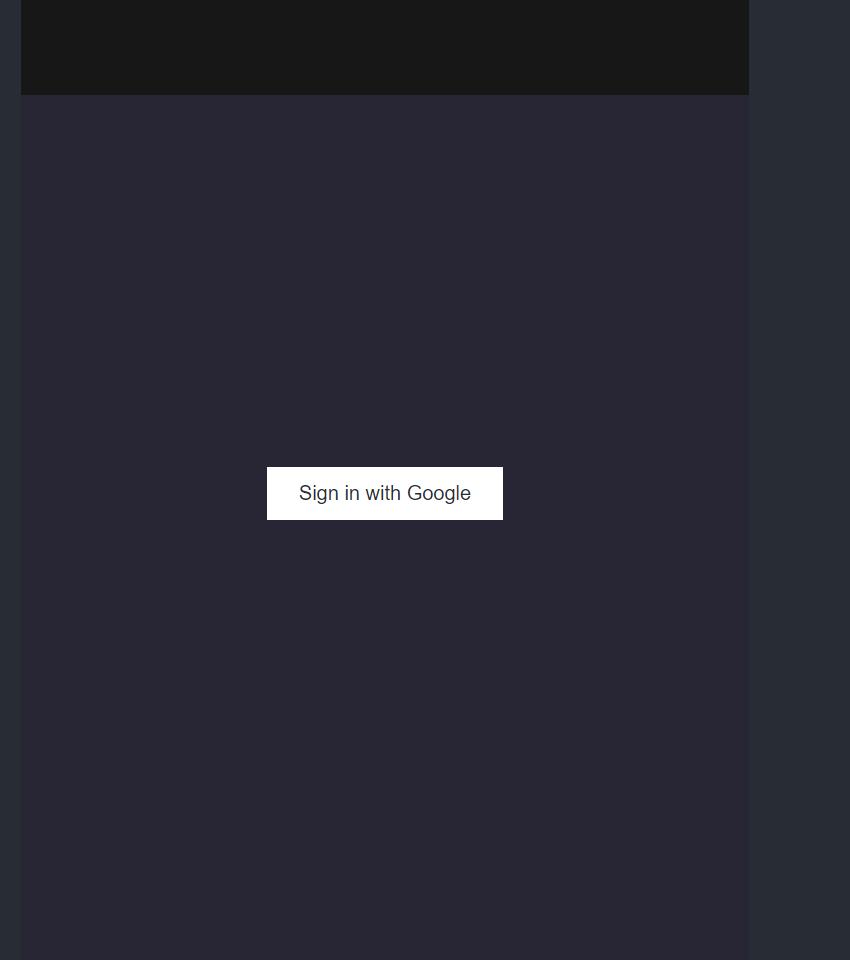
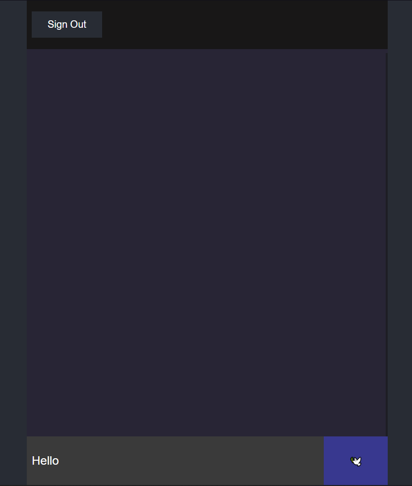

# ChatApp-react

## Description

This is a chat application built with React and Firebase. It allows users to sign in with their Google account and chat with other users in real time. Users can also see the online status of other users.

## Features

- Sign in with Google
- Real-time chat
- Online status indicator

## Technologies

- React
- Firebase
- Material-UI

## Installation

1. Clone the repository
2. Run `npm install` to install the dependencies
3. Create a new Firebase project and add a web app to it
4. Copy the Firebase config object from the Firebase console and paste it in `src/App.jsx`
5. Run `npm run dev` to start the development server

## Screenshots

## License

This project is licensed under the MIT License - see the [LICENSE](LICENSE) file for details

## Acknowledgements

- [Firebase](https://firebase.google.com/)
- [Material-UI](https://material-ui.com/)
- [React](https://reactjs.org/)

## Author

[Neetree](https://github.com/Neetre)
